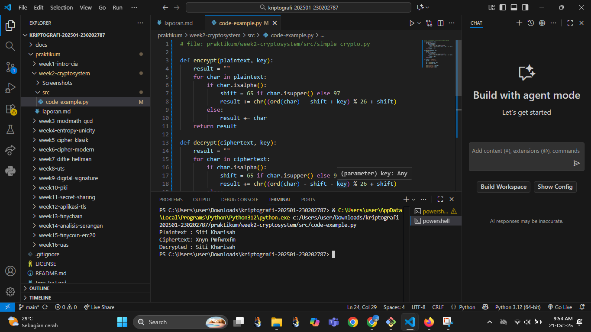
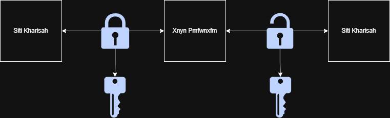

# Laporan Praktikum Kriptografi
Minggu ke-: 2
Topik: [Cryptosystem (Komponen, Enkripsi & Dekripsi, Simetris & Asimetris)]  
Nama: [Siti Kharisah]  
NIM: [230202787]  
Kelas: [5IKRA]  

---

## 1. Tujuan
Setelah mengikuti praktikum ini, mahasiswa diharapkan mampu:

Mengidentifikasi komponen dasar kriptosistem (plaintext, ciphertext, kunci, algoritma).
Menggambarkan proses enkripsi dan dekripsi sederhana.
Mengklasifikasikan jenis kriptosistem (simetris dan asimetris).


---

## 2. Dasar Teori
Cryptosystem adalah sistem yang digunakan untuk melindungi data agar tidak mudah dibaca orang lain. Prosesnya terdiri dari dua tahap utama, yaitu enkripsi dan dekripsi. Enkripsi mengubah pesan asli (plaintext) menjadi bentuk acak (ciphertext) supaya tidak bisa dimengerti. Sedangkan dekripsi adalah kebalikannya — mengubah ciphertext kembali menjadi pesan asli menggunakan kunci tertentu.

Dalam cryptosystem ada beberapa bagian penting, yaitu pesan asli, pesan yang sudah dienkripsi, algoritma yang digunakan untuk mengubah data, dan kunci (key) sebagai alat untuk mengunci dan membuka pesan. Tanpa kunci yang benar, pesan tidak bisa dibaca dengan benar.

Berdasarkan cara penggunaan kuncinya, cryptosystem dibagi dua: kriptografi simetris dan kriptografi asimetris. Pada kriptografi simetris, kunci untuk mengenkripsi dan mendekripsi sama, misalnya pada algoritma AES. Sedangkan pada kriptografi asimetris, digunakan dua kunci berbeda — kunci publik untuk mengunci (enkripsi) dan kunci privat untuk membuka (dekripsi), seperti pada sistem RSA.
---

## 3. Alat dan Bahan
(- Python 3.x  
- Visual Studio Code / editor lain  
- Git dan akun GitHub  
- Library tambahan (misalnya pycryptodome, jika diperlukan)  )

---

## 4. Langkah Percobaan
(Tuliskan langkah yang dilakukan sesuai instruksi.  
Contoh format:
1. Membuat file `caesar_cipher.py` di folder `praktikum/week2-cryptosystem/src/`.
2. Menyalin kode program dari panduan praktikum.
3. Menjalankan program dengan perintah `python caesar_cipher.py`.)

---

## 5. Source Code
    ```python
def encrypt(plaintext, key):
    result = "" 
    for char in plaintext:
        if char.isalpha():
            shift = 65 if char.isupper() else 97
            result += chr((ord(char) - shift + key) % 26 + shift)
        else:
            result += char
    return result

def decrypt(ciphertext, key):
    result = ""
    for char in ciphertext:
        if char.isalpha():
            shift = 65 if char.isupper() else 97
            result += chr((ord(char) - shift - key) % 26 + shift)
        else:
            result += char
    return result

if __name__ == "__main__":
    message = "Cryptosystem Test"
    key = 5

    enc = encrypt(message, key)
    dec = decrypt(enc, key)

    print("Plaintext :", message)
    print("Ciphertext:", enc)
    print("Decrypted :", dec)


## 6. Hasil dan Pembahasan
(- Lampirkan screenshot hasil eksekusi program (taruh di folder `Screenshots/`).  
- Berikan tabel atau ringkasan hasil uji jika diperlukan.  
- Jelaskan apakah hasil sesuai ekspektasi.  
- Bahas error (jika ada) dan solusinya. 

Hasil eksekusi program Caesar Cipher:




)

---

## 7. Jawaban Pertanyaan
(Jawab pertanyaan diskusi yang diberikan pada modul.  
1 - Plaintext (pesan asli),
  - Ciphertext (pesan yang sudah disandikan),
  - Algoritma enkripsi dan dekripsi, serta
  - Kunci (key) yang digunakan untuk proses enkripsi dan dekripsi. 
2 tidak membutuhkan banyak sumber daya. Namun, kelemahannya terletak pada keamanan distribusi kunci—karena pengirim dan penerima harus memiliki kunci yang sama, yang berisiko bocor saat dikirimkan.
3. Distribusi kunci menjadi masalah utama dalam kriptografi simetris karena kunci yang sama harus dibagikan ke pihak lain secara aman. Jika kunci tersebut disadap atau diketahui pihak ketiga, maka seluruh komunikasi bisa dibuka dan keamanan data menjadi tidak terjamin.
)
---

## 8. Kesimpulan
(Berdasarkan percobaan, dapat disimpulkan bahwa proses enkripsi dan dekripsi pada cryptosystem berhasil mengubah data asli menjadi bentuk yang tidak dapat dibaca, lalu mengembalikannya ke bentuk semula menggunakan kunci yang sesuai. Hal ini menunjukkan bahwa sistem kriptografi efektif dalam menjaga keamanan dan kerahasiaan data selama proses pertukaran informasi.)

---

## 9. Daftar Pustaka
(Cantumkan referensi yang digunakan.  
Contoh:  
- Katz, J., & Lindell, Y. *Introduction to Modern Cryptography*.  
- Stallings, W. *Cryptography and Network Security*.  )

---

## 10. Commit Log
( Tuliskan bukti commit Git yang relevan.  
Contoh:
```
commit abc12345
Author: Siti Kharisaha <sitikharisah18@gmail.com.>
Date:   2025-09-20

    week2-cryptosystem: implementasi Caesar Cipher dan laporan )
```
