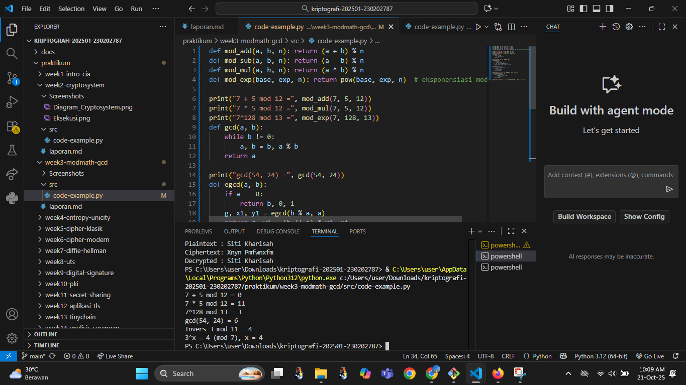

# Laporan Praktikum Kriptografi
Minggu ke-: 3
Topik: [Modular Math (Aritmetika Modular, GCD, Bilangan Prima, Logaritma Diskrit)]  
Nama: [Siti Kharisah]  
NIM: [230202787]  
Kelas: [5IKRA]  

---

## 1. Tujuan
Setelah mengikuti praktikum ini, mahasiswa diharapkan mampu:

Menyelesaikan operasi aritmetika modular.
Menentukan bilangan prima dan menghitung GCD (Greatest Common Divisor).
Menerapkan logaritma diskrit sederhana dalam simulasi kriptografi.

---

## 2. Dasar Teori
Cipher klasik merupakan bentuk awal kriptografi yang menyembunyikan pesan dengan mengganti atau mengacak huruf pada teks asli (plaintext) menjadi teks sandi (ciphertext), seperti pada Caesar Cipher, Vigenère Cipher, dan Transposition Cipher. Proses ini menggunakan operasi matematika sederhana seperti penjumlahan atau perpindahan huruf berdasarkan kunci tertentu. Walaupun mudah dipahami dan diterapkan, cipher klasik memiliki tingkat keamanan rendah terhadap teknik pembobolan modern.

Aritmetika modular menjadi dasar penting dalam kriptografi karena berfungsi mengatur operasi bilangan berdasarkan sisa pembagian terhadap suatu modulus. Konsep seperti Greatest Common Divisor (GCD), bilangan prima, dan logaritma diskrit mendukung keamanan sistem kriptografi. GCD memastikan keberadaan invers modular, bilangan prima menjadi fondasi algoritma modern seperti RSA, sedangkan logaritma diskrit menjadi dasar bagi sistem keamanan publik seperti Diffie-Hellman dan ElGamal.

---

## 3. Alat dan Bahan
(- Python 3.x  
- Visual Studio Code / editor lain  
- Git dan akun GitHub  
- Library tambahan (misalnya pycryptodome, jika diperlukan)  )

---

## 4. Langkah Percobaan
(Tuliskan langkah yang dilakukan sesuai instruksi.  
Contoh format:
1. Membuat file `caesar_cipher.py` di folder `praktikum/week2-cryptosystem/src/`.
2. Menyalin kode program dari panduan praktikum.
3. Menjalankan program dengan perintah `python caesar_cipher.py`.)

---

## 5. Source Code
(Salin kode program utama yang dibuat atau dimodifikasi.  
Gunakan blok kode:

```python
def mod_add(a, b, n): return (a + b) % n
def mod_sub(a, b, n): return (a - b) % n
def mod_mul(a, b, n): return (a * b) % n
def mod_exp(base, exp, n): return pow(base, exp, n)  # eksponensiasi modular

print("7 + 5 mod 12 =", mod_add(7, 5, 12))
print("7 * 5 mod 12 =", mod_mul(7, 5, 12))
print("7^128 mod 13 =", mod_exp(7, 128, 13))
```

### Langkah 2 — GCD & Algoritma Euclidean
Implementasikan fungsi GCD dengan algoritma Euclidean.  
```python
def gcd(a, b):
    while b != 0:
        a, b = b, a % b
    return a

print("gcd(54, 24) =", gcd(54, 24))
```

### Langkah 3 — Extended Euclidean Algorithm
Tambahkan fungsi untuk mencari invers modular.  
```python
def egcd(a, b):
    if a == 0:
        return b, 0, 1
    g, x1, y1 = egcd(b % a, a)
    return g, y1 - (b // a) * x1, x1

def modinv(a, n):
    g, x, _ = egcd(a, n)
    if g != 1:
        return None
    return x % n

print("Invers 3 mod 11 =", modinv(3, 11))  # hasil: 4
```

### Langkah 4 — Logaritma Diskrit (Discrete Log)
Simulasikan logaritma diskrit sederhana: mencari `x` sehingga `a^x ≡ b (mod n)`.  
```python
def discrete_log(a, b, n):
    for x in range(n):
        if pow(a, x, n) == b:
            return x
    return None

print("3^x ≡ 4 (mod 7), x =", discrete_log(3, 4, 7))  # hasil: 4
```
)

---

## 6. Hasil dan Pembahasan
(- Lampirkan screenshot hasil eksekusi program (taruh di folder `screenshots/`).  
- Berikan tabel atau ringkasan hasil uji jika diperlukan.  
- Jelaskan apakah hasil sesuai ekspektasi.  
- Bahas error (jika ada) dan solusinya. 

Hasil eksekusi program Caesar Cipher:




)

---

## 7. Jawaban Pertanyaan
1. Aritmetika modular berperan penting dalam kriptografi modern karena menjadi dasar berbagai operasi matematika yang digunakan untuk mengamankan data. Operasi seperti penjumlahan, perkalian, dan perpangkatan modular digunakan dalam algoritma kriptografi kunci publik seperti RSA, Diffie–Hellman, dan ElGamal. Prinsip utamanya adalah menciptakan fungsi satu arah yang mudah dihitung tetapi sulit dibalik, sehingga menjamin keamanan proses enkripsi dan dekripsi. Selain itu, aritmetika modular juga digunakan dalam tanda tangan digital dan fungsi hash untuk menjaga integritas serta keaslian data. Dengan efisiensi dan ketepatan perhitungannya, aritmetika modular menjadi fondasi utama bagi sistem keamanan digital masa kini.

2. Invers modular sangat penting dalam algoritma kunci publik seperti RSA karena berfungsi sebagai kunci untuk membalik proses enkripsi menjadi dekripsi. Dalam RSA, dua kunci digunakan: kunci publik (e,n)(e, n)(e,n) untuk enkripsi dan kunci privat (d,n)(d, n)(d,n) untuk dekripsi. Nilai ddd diperoleh sebagai invers modular dari eee terhadap φ(n)\varphi(n)φ(n), yaitu memenuhi persamaan:
e×d≡1(modφ(n))e \times d \equiv 1 \pmod{\varphi(n)}e×d≡1(modφ(n))
Artinya, ddd adalah nilai yang jika dikalikan dengan eee, hasilnya akan kembali ke 1 dalam sistem modulo φ(n)\varphi(n)φ(n). Tanpa invers modular ini, pesan yang telah dienkripsi tidak bisa dikembalikan ke bentuk aslinya secara aman. Dengan demikian, invers modular menjamin bahwa hanya pemilik kunci privat yang dapat melakukan proses dekripsi, sehingga menjaga kerahasiaan komunikasi dalam sistem kriptografi RSA.

3. Tantangan utama dalam menyelesaikan logaritma diskrit untuk modulus besar adalah karna kompleksitas komputasinya yang sangat tinggi dalam masalah logaritma diskrits ketika mencari nilai x pada persamaan gx≡y(modp) dengan ggg dan yyy diketahui, serta ppp adalah bilangan prima besar. Tantangannya terletak pada fakta bahwa tidak ada algoritma efisien yang mampu menemukan xxx dengan cepat ketika ppp bernilai sangat besar (misalnya ratusan atau ribuan bit). Proses pencarian xxx secara brute force memerlukan waktu eksponensial terhadap ukuran modulus.
Selain itu, metode yang lebih canggih seperti Baby-step Giant-step, Pollard’s rho, atau Index Calculus tetap memerlukan sumber daya besar dan waktu yang lama untuk modulus besar. Karena kesulitan inilah, logaritma diskrit menjadi dasar keamanan bagi banyak sistem kriptografi modern seperti Diffie–Hellman, ElGamal, dan DSA — di mana keamanan bergantung pada ketidakmampuan penyerang memecahkan logaritma diskrit dalam waktu yang wajar.
---

## 8. Kesimpulan
(Tuliskan kesimpulan singkat (2–3 kalimat) berdasarkan percobaan.  )

---

## 9. Daftar Pustaka
(Cantumkan referensi yang digunakan.  
Contoh:  
- Katz, J., & Lindell, Y. *Introduction to Modern Cryptography*.  
- Stallings, W. *Cryptography and Network Security*.  )

---

## 10. Commit Log
(Tuliskan bukti commit Git yang relevan.  
Contoh:
```
commit abc12345
Author: Nama Mahasiswa <email>
Date:   2025-09-20

    week2-cryptosystem: implementasi Caesar Cipher dan laporan )
```
