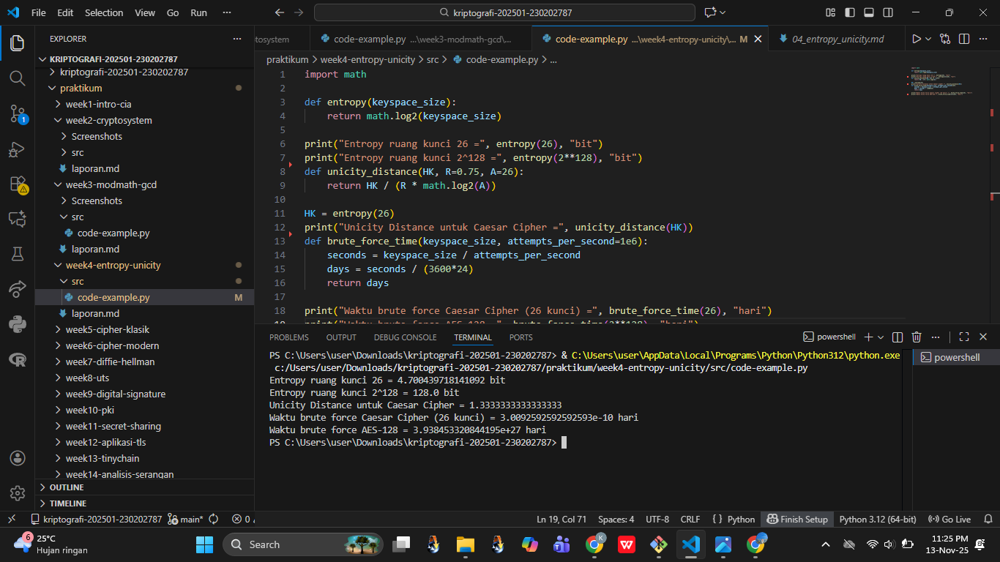

# Laporan Praktikum Kriptografi
Minggu ke-: 4 
Topik: Entropy & Unicity Distance Evaluasi Kekuatan Kunci dan Brute Force
Nama: Siti Kharisah  
NIM: 230202787
Kelas: 5IKRA  

---

## 1. Tujuan
Setelah mengikuti praktikum ini, mahasiswa diharapkan mampu:  
1. Menyelesaikan perhitungan sederhana terkait entropi kunci.  
2. Menggunakan teorema Euler pada contoh perhitungan modular & invers.  
3. Menghitung **unicity distance** untuk ciphertext tertentu.  
4. Menganalisis kekuatan kunci berdasarkan entropi dan unicity distance.  
5. Mengevaluasi potensi serangan brute force pada kriptosistem sederhana. 

---

## 2. Dasar Teori
Entropy dalam kriptografi menggambarkan tingkat ketidakpastian atau keacakan dari suatu kunci. Semakin tinggi nilai entropy, semakin sulit bagi pihak lain menebak atau memprediksi kunci tersebut, sehingga sistem menjadi lebih aman. Entropy yang baik memastikan bahwa setiap kemungkinan kunci memiliki peluang yang hampir sama untuk muncul, sehingga serangan berbasis tebakan menjadi tidak efektif.

Unicity Distance adalah ukuran yang menunjukkan berapa banyak ciphertext yang diperlukan agar kunci bisa ditentukan secara unik oleh penyerang. Semakin besar nilai unicity distance, semakin sulit untuk menemukan kunci yang benar karena dibutuhkan lebih banyak data terenkripsi. Nilai ini bergantung pada panjang kunci dan kompleksitas algoritma yang digunakan.

Dalam konteks evaluasi kekuatan kunci, kedua konsep ini membantu menilai seberapa tahan suatu sistem terhadap serangan brute force, yaitu upaya mencoba semua kemungkinan kunci hingga ditemukan yang benar. Kunci dengan entropy tinggi dan unicity distance besar akan membuat brute force membutuhkan waktu yang sangat lama, sehingga sistem kriptografi menjadi jauh lebih aman.

---

## 3. Alat dan Bahan
(- Python 3.x  
- Visual Studio Code / editor lain  
- Git dan akun GitHub  
- Library tambahan (misalnya pycryptodome, jika diperlukan)  )

---

## 4. Langkah Percobaan
(Tuliskan langkah yang dilakukan sesuai instruksi.  
Contoh format:
1. Membuat file `caesar_cipher.py` di folder `praktikum/week2-cryptosystem/src/`.
2. Menyalin kode program dari panduan praktikum.
3. Menjalankan program dengan perintah `python caesar_cipher.py`.)

---

## 5. Source Code
(Salin kode program utama yang dibuat atau dimodifikasi.  
Gunakan blok kode:

```python
import math

def entropy(keyspace_size):
    return math.log2(keyspace_size)

print("Entropy ruang kunci 26 =", entropy(26), "bit")
print("Entropy ruang kunci 2^128 =", entropy(2**128), "bit")
```

### Langkah 2 — Menghitung Unicity Distance
Gunakan rumus:  
\[
U = \frac{H(K)}{R \cdot \log_2 |A|}
\]  
dengan:  
- \(H(K)\): entropi kunci,  
- \(R\): redundansi bahasa (misal bahasa Inggris \(R \approx 0.75\)),  
- \(|A|\): ukuran alfabet (26 untuk A–Z).  

Contoh implementasi Python:  
```python
def unicity_distance(HK, R=0.75, A=26):
    return HK / (R * math.log2(A))

HK = entropy(26)
print("Unicity Distance untuk Caesar Cipher =", unicity_distance(HK))
```

### Langkah 3 — Analisis Brute Force
Simulasikan waktu brute force dengan asumsi kecepatan komputer tertentu.  

```python
def brute_force_time(keyspace_size, attempts_per_second=1e6):
    seconds = keyspace_size / attempts_per_second
    days = seconds / (3600*24)
    return days

print("Waktu brute force Caesar Cipher (26 kunci) =", brute_force_time(26), "hari")
print("Waktu brute force AES-128 =", brute_force_time(2**128), "hari")
```
)

---

## 6. Hasil dan Pembahasan
 

Hasil eksekusi program Caesar Cipher:




---

## 7. Jawaban Pertanyaan
1. Nilai entropy dalam konteks kekuatan kunci menunjukkan tingkat keacakan dan ketidakpastian dari kunci yang digunakan. Semakin tinggi nilai entropy, semakin sulit bagi penyerang untuk menebak atau memprediksi kunci, sehingga sistem kriptografi menjadi lebih aman.

2. Unicity distance penting karena menunjukkan jumlah data terenkripsi (ciphertext) yang dibutuhkan untuk dapat menebak kunci secara unik. Jika unicity distance suatu cipher tinggi, maka penyerang memerlukan lebih banyak ciphertext untuk menemukan kunci yang benar, sehingga tingkat keamanannya lebih besar.

3. Brute force masih menjadi ancaman meskipun algoritma sudah kuat, karena metode ini tidak bergantung pada kelemahan algoritma, melainkan mencoba semua kemungkinan kunci hingga menemukan yang benar. Jika panjang kunci terlalu pendek atau sistem memiliki kelemahan implementasi, brute force tetap bisa berhasil meskipun algoritmanya secara teoritis aman.
---

## 8. Kesimpulan
Berdasarkan percobaan, dapat disimpulkan bahwa nilai entropy dan unicity distance berpengaruh langsung terhadap kekuatan kunci dalam kriptografi. Semakin tinggi entropy dan semakin besar unicity distance, maka semakin sulit sistem untuk diretas menggunakan metode brute force. Hal ini membuktikan bahwa kunci yang acak dan kompleks mampu meningkatkan keamanan data secara signifikan.

---

## 9. Daftar Pustaka
(Cantumkan referensi yang digunakan.  
Contoh:  
- Katz, J., & Lindell, Y. *Introduction to Modern Cryptography*.  
- Stallings, W. *Cryptography and Network Security*.  )

---

## 10. Commit Log
```
commit f153e80e498ea8475abb53c5c052df1b6a07704c
Author: sitikharisah18-bot <sitikharisah18@gmail.com>
Date:   Thu Dec 18 09:56:51 2025 +0700

    week10-entropy-unicity
```
