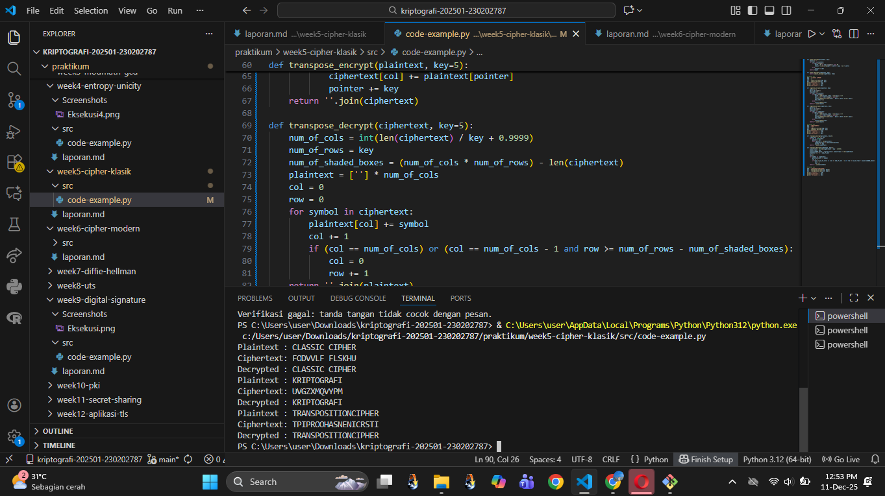

# Laporan Praktikum Kriptografi
Minggu ke-: 5
Topik: Cipher Klasik (Caesar, Vigenère, Transposisi)
Nama: Siti Kharisah
NIM: 230202787
Kelas: 5IKRA  

---

## 1. Tujuan
1. Menerapkan algoritma **Caesar Cipher** untuk enkripsi dan dekripsi teks.  
2. Menerapkan algoritma **Vigenère Cipher** dengan variasi kunci.  
3. Mengimplementasikan algoritma transposisi sederhana.  
4. Menjelaskan kelemahan algoritma kriptografi klasik.  


---

## 2. Dasar Teori
Cipher klasik adalah teknik penyandian awal yang bertujuan mengubah plaintext menjadi ciphertext menggunakan aturan sederhana, sehingga pesan tidak mudah dibaca oleh pihak yang tidak berkepentingan. Salah satu metode paling dasar adalah Caesar Cipher, yaitu menggeser setiap huruf pada plaintext dengan jumlah pergeseran tertentu. Misalnya, pergeseran 3 akan mengubah huruf A menjadi D. Teknik ini mudah dibuat namun juga mudah dipecahkan, terutama dengan brute force atau analisis frekuensi.

Selanjutnya, Vigenère Cipher mengembangkan konsep Caesar dengan menggunakan kunci berupa kata yang menciptakan serangkaian pergeseran berbeda untuk setiap huruf. Metode ini jauh lebih kuat daripada Caesar karena pola pergeseran tidak konstan, sehingga analisis frekuensi menjadi lebih sulit. Meski begitu, Vigenère tetap dapat ditembus dengan metode seperti Kasiski examination jika panjang kuncinya dapat diperkirakan.

Jenis lainnya adalah Transposition Cipher, yang tidak mengubah huruf tetapi menukar urutan karakter berdasarkan aturan tertentu, seperti Columnar Transposition. Keamanannya bergantung pada kerumitan pola penyusunan ulang huruf. Secara umum, cipher klasik kurang aman untuk standar modern, tetapi sangat penting sebagai dasar memahami konsep kriptografi, kunci, penyandian, dan analisis serangan.

---

## 3. Alat dan Bahan
(- Python 3.x  
- Visual Studio Code / editor lain  
- Git dan akun GitHub  
- Library tambahan (misalnya pycryptodome, jika diperlukan)  )

---

## 4. Langkah Percobaan
(Tuliskan langkah yang dilakukan sesuai instruksi.  
Contoh format:
1. Membuat file `caesar_cipher.py` di folder `praktikum/week2-cryptosystem/src/`.
2. Menyalin kode program dari panduan praktikum.
3. Menjalankan program dengan perintah `python caesar_cipher.py`.)

---

## 5. Source Code
(Salin kode program utama yang dibuat atau dimodifikasi.  
Gunakan blok kode:

```python
def caesar_encrypt(plaintext, key):
    result = ""
    for char in plaintext:
        if char.isalpha():
            shift = 65 if char.isupper() else 97
            result += chr((ord(char) - shift + key) % 26 + shift)
        else:
            result += char
    return result

def caesar_decrypt(ciphertext, key):
    return caesar_encrypt(ciphertext, -key)

# Contoh uji
msg = "CLASSIC CIPHER"
key = 3
enc = caesar_encrypt(msg, key)
dec = caesar_decrypt(enc, key)
print("Plaintext :", msg)
print("Ciphertext:", enc)
print("Decrypted :", dec)
```

---

### Langkah 2 — Implementasi Vigenère Cipher
```python
def vigenere_encrypt(plaintext, key):
    result = []
    key = key.lower()
    key_index = 0
    for char in plaintext:
        if char.isalpha():
            shift = ord(key[key_index % len(key)]) - 97
            base = 65 if char.isupper() else 97
            result.append(chr((ord(char) - base + shift) % 26 + base))
            key_index += 1
        else:
            result.append(char)
    return "".join(result)

def vigenere_decrypt(ciphertext, key):
    result = []
    key = key.lower()
    key_index = 0
    for char in ciphertext:
        if char.isalpha():
            shift = ord(key[key_index % len(key)]) - 97
            base = 65 if char.isupper() else 97
            result.append(chr((ord(char) - base - shift) % 26 + base))
            key_index += 1
        else:
            result.append(char)
    return "".join(result)

# Contoh uji
msg = "KRIPTOGRAFI"
key = "KEY"
enc = vigenere_encrypt(msg, key)
dec = vigenere_decrypt(enc, key)
print("Plaintext :", msg)
print("Ciphertext:", enc)
print("Decrypted :", dec)
```

---

### Langkah 3 — Implementasi Transposisi Sederhana
```python
def transpose_encrypt(plaintext, key=5):
    ciphertext = [''] * key
    for col in range(key):
        pointer = col
        while pointer < len(plaintext):
            ciphertext[col] += plaintext[pointer]
            pointer += key
    return ''.join(ciphertext)

def transpose_decrypt(ciphertext, key=5):
    num_of_cols = int(len(ciphertext) / key + 0.9999)
    num_of_rows = key
    num_of_shaded_boxes = (num_of_cols * num_of_rows) - len(ciphertext)
    plaintext = [''] * num_of_cols
    col = 0
    row = 0
    for symbol in ciphertext:
        plaintext[col] += symbol
        col += 1
        if (col == num_of_cols) or (col == num_of_cols - 1 and row >= num_of_rows - num_of_shaded_boxes):
            col = 0
            row += 1
    return ''.join(plaintext)

# Contoh uji
msg = "TRANSPOSITIONCIPHER"
enc = transpose_encrypt(msg, key=5)
dec = transpose_decrypt(enc, key=5)
print("Plaintext :", msg)
print("Ciphertext:", enc)
print("Decrypted :", dec)
```

)

---

## 6. Hasil dan Pembahasan
(- Lampirkan screenshot hasil eksekusi program (taruh di folder `screenshots/`).  
- Berikan tabel atau ringkasan hasil uji jika diperlukan.  
- Jelaskan apakah hasil sesuai ekspektasi.  
- Bahas error (jika ada) dan solusinya. 

Hasil eksekusi program Caesar Cipher:




)

---

## 7. Jawaban Pertanyaan
1. Caesar Cipher memiliki kelemahan utama karena hanya menggunakan satu pola pergeseran tetap untuk seluruh huruf pada pesan. Hal ini membuat ruang kunci sangat kecil (hanya 25 kemungkinan), sehingga serangan brute force sangat mudah dilakukan. Selain itu, pola frekuensi huruf pada ciphertext tetap mirip dengan plaintext, sehingga mudah dipecahkan oleh analisis frekuensi.

Vigenère Cipher, meskipun lebih kuat, tetap memiliki kelemahan karena pola kuncinya bersifat berulang. Jika panjang kunci dapat ditemukan (misalnya dengan metode Kasiski atau Friedman test), ciphertext dapat dipecah menjadi beberapa Caesar Cipher terpisah yang lebih mudah dipecahkan. Jadi, keamanan Vigenère sangat bergantung pada panjang dan kerahasiaan kunci.
2. Cipher klasik umumnya tidak menghilangkan pola statistik pada bahasa. Dalam bahasa seperti Indonesia atau Inggris, beberapa huruf muncul lebih sering (misalnya: A, E). Dalam cipher substitusi sederhana, frekuensi kemunculan huruf-huruf ini masih terlihat meskipun hurufnya diganti. Penyerang dapat membandingkan pola frekuensi ciphertext dengan frekuensi huruf umum untuk menebak huruf-huruf yang disubstitusi. Karena struktur bahasa tetap “bocor”, cipher klasik dapat dipecahkan tanpa mengetahui kunci.
3. Cipher substitusi mengganti huruf plaintext dengan huruf lain, sehingga bentuk huruf berubah tetapi masih meninggalkan pola frekuensi yang mudah dianalisis. Sebaliknya, cipher transposisi tidak mengubah huruf, melainkan hanya mengacak posisinya sehingga pola huruf tetap tetapi urutannya berubah. Substitusi lebih mudah diterapkan namun lebih lemah terhadap analisis frekuensi, sedangkan transposisi sedikit lebih kuat tetapi tetap dapat dipecahkan jika polanya sederhana. Secara keseluruhan, keduanya memiliki kelemahan mendasar dan tidak aman untuk standar modern.
---

## 8. Kesimpulan
Percobaan menunjukkan bahwa cipher klasik seperti Caesar, Vigenère, dan Transposisi masih meninggalkan pola yang dapat dianalisis, sehingga keamanannya rendah. Meskipun tekniknya berbeda—substitusi mengubah huruf dan transposisi mengacak posisi—keduanya tetap dapat dipecahkan dengan metode analisis sederhana. Dengan demikian, cipher klasik hanya cocok untuk pembelajaran dasar, bukan untuk keamanan modern.

---

## 9. Daftar Pustaka
(Cantumkan referensi yang digunakan.  
Contoh:  
- Katz, J., & Lindell, Y. *Introduction to Modern Cryptography*.  
- Stallings, W. *Cryptography and Network Security*.  )

---

## 10. Commit Log
(Tuliskan bukti commit Git yang relevan.  
Contoh:
```
commit abc12345
Author: Nama Mahasiswa <email>
Date:   2025-09-20

    week2-cryptosystem: implementasi Caesar Cipher dan laporan )
```
